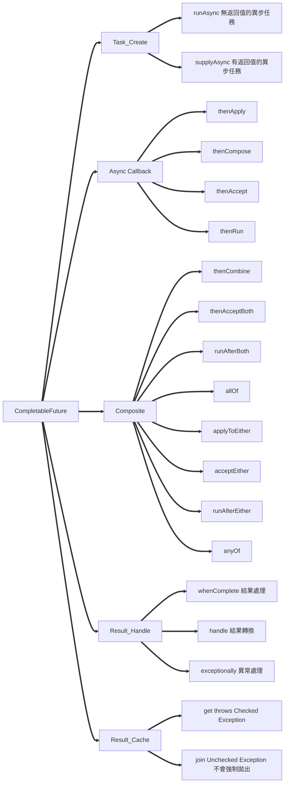

# 

```mermaid
flowchart LR
    CF[CompletableFuture]
    
    TC[Task_Create]
    rA[runAsync 無返回值的異步任務]
    sA[supplyAsync 有返回值的異步任務]
    
    AC[Async Callback]
    tA[thenApply]
    tCp[thenCompose]
    tAc[thenAccept]
    tR[thenRun]
    
    
    C[Composite]
    tCb[thenCombine]
    tAB[thenAcceptBoth]
    rAB[runAfterBoth]
    allO[allOf]
    aTE[applyToEither]
    aE[acceptEither]
    rAE[runAfterEither]
    anyO[anyOf]
    
    RH[Result_Handle]
    wC[whenComplete 結果處理]
    hd[handle 結果轉換]
    exc[exceptionally 異常處理]
    
    RC[Result_Cache]
    g[get throws Checked Exception]
    j[join Unchecked Exception 不會強制拋出]
    
    CF ==> TC
    CF ==> AC
    CF ==> C
    CF ==> RH
    CF ==> RC
    
    TC ==> rA
    TC ==> sA
    
    AC ==> tA
    AC ==> tCp
    AC ==> tAc
    AC ==> tR
    
    C ==> tCb
    C ==> tAB
    C ==> rAB
    C ==> allO
    C ==> aTE
    C ==> aE
    C ==> rAE
    C ==> anyO
    
    RH ==> wC
    RH ==> hd
    RH ==> exc
    
    RC ==> g
    RC ==> j
```
