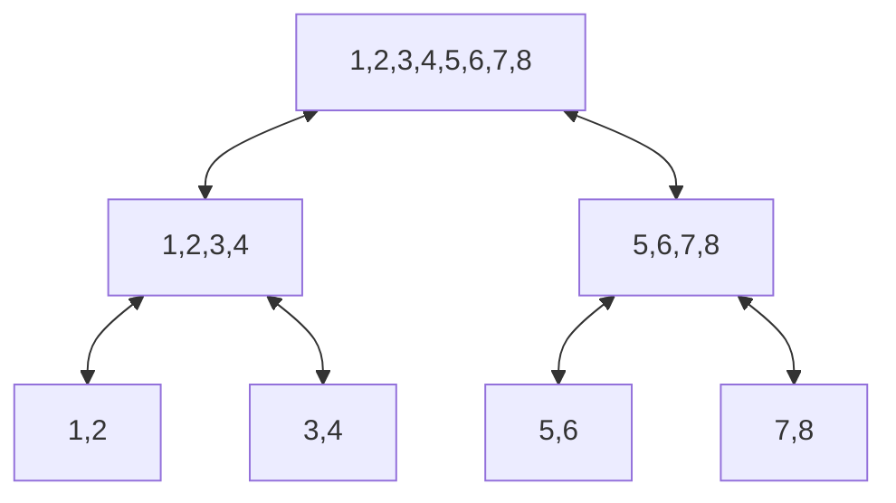
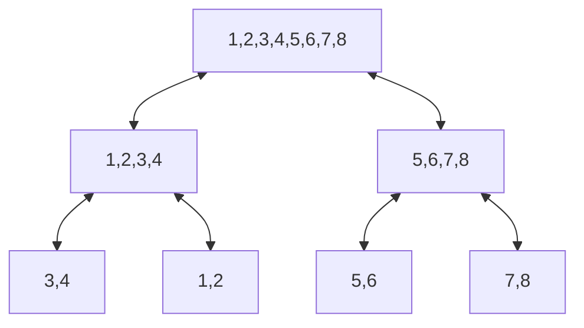

- `t1.fork()`, `t2.fork()`
- `t1.join() + t2.join()`
  - 7 Threads

```mermaid
flowchart TD
    T1[1,2,3,4,5,6,7,8]
    T2[1,2,3,4]
    T3[5,6,7,8]
    T4[1,2]
    T5[3,4]
    T6[5,6]
    T7[7,8]
    
    T1 <--> T2
    T1 <--> T3
    
    T2 <--> T4
    T2 <--> T5

    T3 <--> T6
    T3 <--> T7
```
- `t1.fork()`
- `t1.join() + t2.compute()`
  - 4 Threads

```mermaid
flowchart TD
    T1[1,2,3,4,5,6,7,8]
    T2[1,2,3,4]
    T1C1[5,6,7,8]
    T3[1,2]
    T2C1[3,4]
    T4[5,6]
    T1C2[7,8]

    T1 <--> T2
    T1 <--> T1C1

    T2 <--> T2C1
    T2 <--> T3

    T1C1 <--> T4
    T1C1 <--> T1C2
```